# MEAN STACK DEPLOYMENT TO UBUNTU IN AWS

## MEAN Stack is a combination of following components:

**1. MongoDB** (Document database) – Stores and allows to retrieve data.

**2. Express** (Back-end application framework) – Makes requests to Database for Reads and Writes.
	
**3. Angular** (Front-end application framework) – Handles Client and Server Requests
	
**4. Node.js** (JavaScript runtime environment) – Accepts requests and displays results to end user

## Create a new EC2 Instance of t2.nano family with Ubuntu Server 20.04 LTS (HVM) image

**Step 1: Install NodeJs** *Node.js is a JavaScript runtime built on Chrome’s V8 JavaScript engine*

*Update ubuntu*

`sudo apt update`

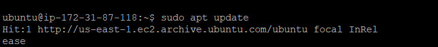

*Upgrade ubuntu*

`sudo apt upgrade`

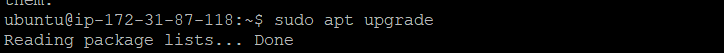

*Add certificates*

`sudo apt -y install curl dirmngr apt-transport-https lsb-release ca-certificates
curl -sL https://deb.nodesource.com/setup_12.x | sudo -E bash -`

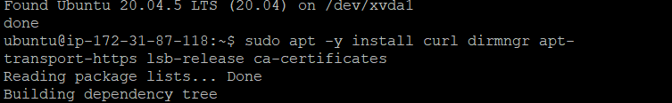

*Install NodeJS*

`sudo apt install -y nodejs`

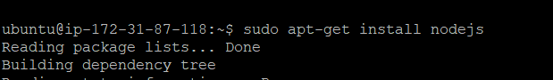

**Step 2: Install MongoDB**

#### MongoDB stores data in flexible, JSON-like documents. Fields in a database can vary from document to document and data structure can be changed over time. In this instance, will be adding book records to MongoDB that contains book name, isbn number, author, and number of pages

*Add Mongodb key to key server*

`sudo apt-key adv --keyserver hkp://keyserver.ubuntu.com:80 --recv 0C49F3730359A14518585931BC711F9BA15703C6`

*Add repository for Mongodb*

`echo "deb [ arch=amd64 ] https://repo.mongodb.org/apt/ubuntu trusty/mongodb-org/3.4 multiverse" | sudo tee /etc/apt/sources.list.d/mongodb-org-3.4.list`

*Install Mongodb*

`sudo apt install mongodb -y`

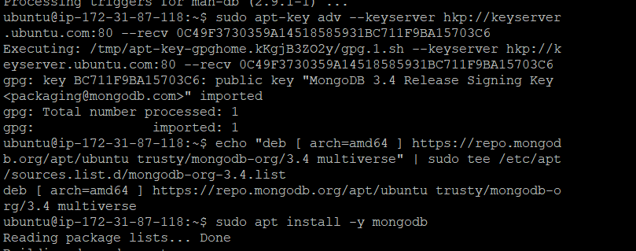

*Start The server with `sudo service mongodb start` or `sudo systemctl mongodb start`.  Also ensure the service is enabled and running*

`sudo service mongodb start`

*Verify that the service is up and running*

`sudo systemctl status mongodb`

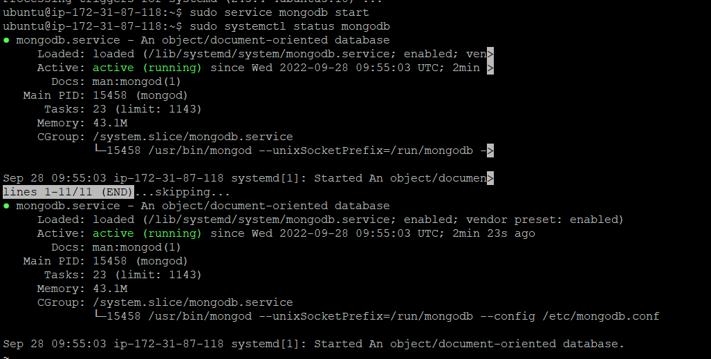

*Install npm – Node package manager.*

`sudo apt install -y -npm`

*Install body-parser package to help us process JSON files passed in requests to the server*

`sudo npm install body-parser`

*Create a folder named ‘Books’ and navigate into the Books directory and initialise npm project*

`mkdir Books && cd Books`

*Initialise your project, so that a new file named package.json will be created. This file will normally contain information about your application and the dependencies that it needs to run. Follow the prompts after running the command. You can press **Enter** several times to accept default values, then accept to write out the package.json file by typing **yes***

`npm init`

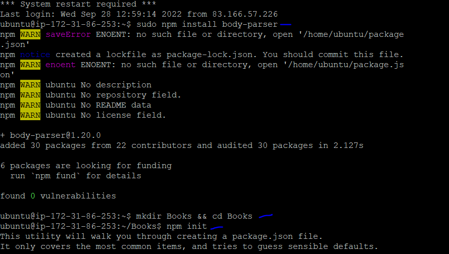

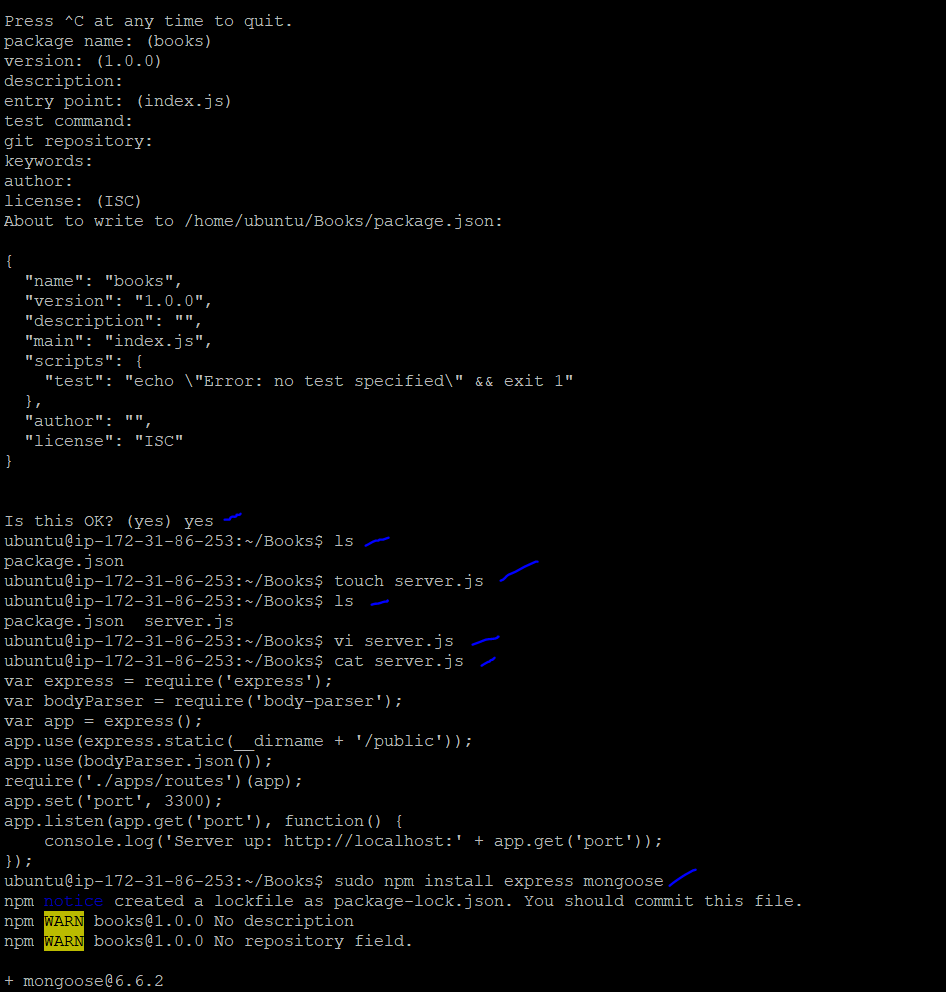

*Add a file to the Books directory and name it server.js*

`touch server.js`

*Open server.js using any editor*

`vi server.js`

*Save below code into the server.js file*

```
var express = require('express');
var bodyParser = require('body-parser');
var app = express();
app.use(express.static(__dirname + '/public'));
app.use(bodyParser.json());
require('./apps/routes')(app);
app.set('port', 3300);
app.listen(app.get('port'), function() {
    console.log('Server up: http://localhost:' + app.get('port'));
});
```


**INSTALL EXPRESS AND SET UP ROUTES TO THE SERVER**
#### Express is a minimal and flexible Node.js web application framework that provides features for web and mobile applications. Express will be use to pass book information to and from our MongoDB database. Mongoose package which provides a straight-forward, schema-based solution to model your application data. We will use Mongoose to establish a schema for the database to store data of our book register.

*Installing express and mongoose*

`sudo npm install express mongoose`


*In ‘Books’ folder, create a folder named apps and navigate into the apps folder/directory*

`mkdir apps && cd apps`

*Create file routes.js. This can be done using commands below seperately or just `vi routes.js`*

`touch routes.js && vi routes.js`

*Paste below code into the routes.js file then save*

```
var Book = require('./models/book');
module.exports = function(app) {
  app.get('/book', function(req, res) {
    Book.find({}, function(err, result) {
      if ( err ) throw err;
      res.json(result);
    });
  }); 
  app.post('/book', function(req, res) {
    var book = new Book( {
      name:req.body.name,
      isbn:req.body.isbn,
      author:req.body.author,
      pages:req.body.pages
    });
    book.save(function(err, result) {
      if ( err ) throw err;
      res.json( {
        message:"Successfully added book",
        book:result
      });
    });
  });
  app.delete("/book/:isbn", function(req, res) {
    Book.findOneAndRemove(req.query, function(err, result) {
      if ( err ) throw err;
      res.json( {
        message: "Successfully deleted the book",
        book: result
      });
    });
  });
  var path = require('path');
  app.get('*', function(req, res) {
    res.sendfile(path.join(__dirname + '/public', 'index.html'));
  });
};
```

*In the ‘apps’ folder, create a folder named models and navigate into the models folder*

`mkdir models && cd models`

*Create a file book.js, open the fole with prefered editor*

`vi book.js`

*Paste the code below into ‘book.js’*

```
var mongoose = require('mongoose');
var dbHost = 'mongodb://localhost:27017/test';
mongoose.connect(dbHost);
mongoose.connection;
mongoose.set('debug', true);
var bookSchema = mongoose.Schema( {
  name: String,
  isbn: {type: String, index: true},
  author: String,
  pages: Number
});
var Book = mongoose.model('Book', bookSchema);
module.exports = mongoose.model('Book', bookSchema);
```
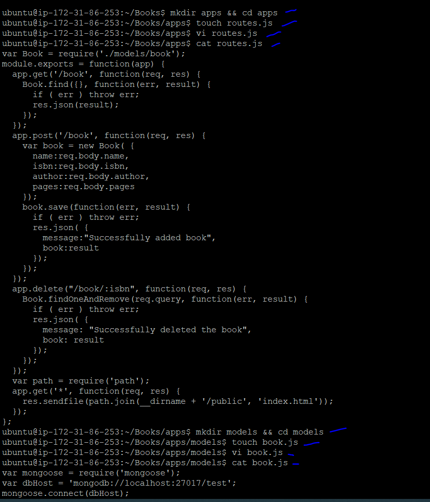

**Step 4 – Access the routes with AngularJS** 
#### AngularJS provides a web framework for creating dynamic views in your web applications. It will be use to connect our web page with Express and perform actions on our book register.

*Change the directory back to ‘Books’ and Create a folder named public*

`mkdir public && cd public`

*Add a file named script.js*

`vi script.js`

*Copy and paste the Code below (controller configuration defined) into the script.js file.*

```
var app = angular.module('myApp', []);
app.controller('myCtrl', function($scope, $http) {
  $http( {
    method: 'GET',
    url: '/book'
  }).then(function successCallback(response) {
    $scope.books = response.data;
  }, function errorCallback(response) {
    console.log('Error: ' + response);
  });
  $scope.del_book = function(book) {
    $http( {
      method: 'DELETE',
      url: '/book/:isbn',
      params: {'isbn': book.isbn}
    }).then(function successCallback(response) {
      console.log(response);
    }, function errorCallback(response) {
      console.log('Error: ' + response);
    });
  };
  $scope.add_book = function() {
    var body = '{ "name": "' + $scope.Name + 
    '", "isbn": "' + $scope.Isbn +
    '", "author": "' + $scope.Author + 
    '", "pages": "' + $scope.Pages + '" }';
    $http({
      method: 'POST',
      url: '/book',
      data: body
    }).then(function successCallback(response) {
      console.log(response);
    }, function errorCallback(response) {
      console.log('Error: ' + response);
    });
  };
});
```
*In public folder, create a file named index.html*

`vi index.html`

*Copy and paste the code below into index.html file*

```
<!doctype html>
<html ng-app="myApp" ng-controller="myCtrl">
  <head>
    <script src="https://ajax.googleapis.com/ajax/libs/angularjs/1.6.4/angular.min.js"></script>
    <script src="script.js"></script>
  </head>
  <body>
    <div>
      <table>
        <tr>
          <td>Name:</td>
          <td><input type="text" ng-model="Name"></td>
        </tr>
        <tr>
          <td>Isbn:</td>
          <td><input type="text" ng-model="Isbn"></td>
        </tr>
        <tr>
          <td>Author:</td>
          <td><input type="text" ng-model="Author"></td>
        </tr>
        <tr>
          <td>Pages:</td>
          <td><input type="number" ng-model="Pages"></td>
        </tr>
      </table>
      <button ng-click="add_book()">Add</button>
    </div>
    <hr>
    <div>
      <table>
        <tr>
          <th>Name</th>
          <th>Isbn</th>
          <th>Author</th>
          <th>Pages</th>
</tr>
        <tr ng-repeat="book in books">
          <td>{{book.name}}</td>
          <td>{{book.isbn}}</td>
          <td>{{book.author}}</td>
          <td>{{book.pages}}</td>
<td><input type="button" value="Delete" data-ng-click="del_book(book)"></td>
        </tr>
      </table>
    </div>
  </body>
</html>
```
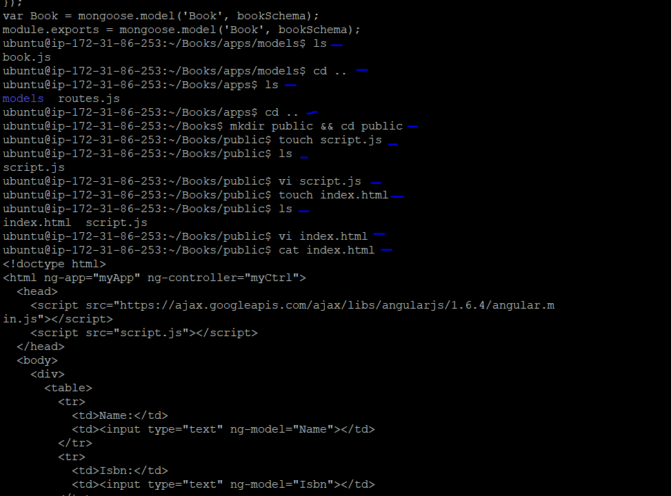

*Change the directory back up to Books and Start the server by running this command*

`node server.js`

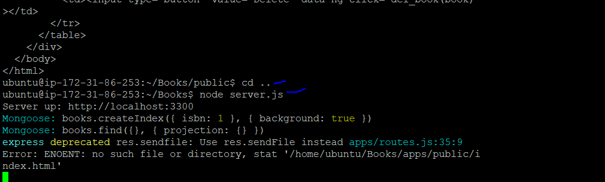

*The server is now up and running, we can connect it via port 3300 usiing the public IP on the browser. Launch a separate Putty or SSH console to test what curl command returns locally.*

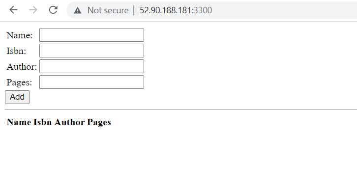

*Curl command output via shell*

`curl -s http://localhost:3300`

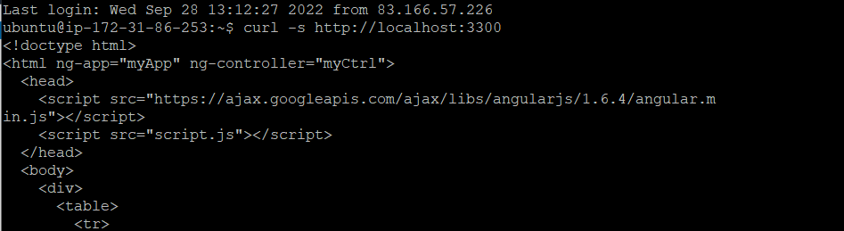